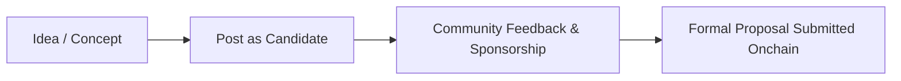

Within the Nouns DAO ecosystem, every proposal starts as an idea - and often as a “candidate”. A candidate proposal gives community members a chance to signal interest and gather feedback before a formal onchain submission. This article explains how candidates work, how ideas progress into formal proposals, and how you can participate in or support the process.

---

## What is a Candidate?

A candidate is essentially an early stage proposal posted to community channels (such as the Discourse forum) for feedback, refinement and sponsorship. It allows non-holders or early-stage ideas to surface and iterate before being submitted on-chain. For example:

- One discussion thread noted: “you can absolutely use the candidate functionality which doesn’t require you to hold Nouns to put a proposal forward.”
- The official site indicates that proposals must be submitted on-chain by Noun holders and meet certain thresholds.

## Why Use Candidates?

Using the candidate stage offers multiple benefits:

- **Feedback & refinement**: You can gather community input and iterate your idea before locking in the proposal for voting. Getting feedback early helps identify weak aspects (budget, clarity, alignment) before escalation to the onchain governance process.
- **Sponsorships**: If you don’t have the required Nouns or delegation for submitting a proposal onchain, you can attract Noun holders to sponsor your idea.

## How the Process Works

### 1. Post the idea as a candidate

Create a candidate through your preferred governance client. Include a clear overview: what you propose, why it matters, how it aligns with Nouns DAO goals.

### 2. Gather feedback and iterate

Invite discussion, respond to comments, refine your deliverables, budget and metrics. Networking in the Discord or Farcaster ecosystem helps increase visibility.

### 3. Secure sponsorship (if necessary)

If you are not a Noun holder or do not meet onchain submission thresholds, you’ll need a sponsoring Noun holder who agrees to advance your idea to an onchain proposal.

### 4. Formal submission onchain

Once ready and sponsored, the proposal author submits the proposal. Requirements include holding minimum voting power and maintaining it through execution. 

### 5. Voting & execution

After submission, the proposal enters the official voting process: an editable period, pending phase, active voting window, then if it passes - security delay, and finally execution.
