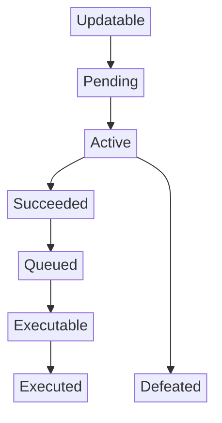

import {
  dynamicQuorumParams,
  quorumIncreasePerAgainstVote,
  maxQuorumAgainstVotes,
  minProposalDurationDays,
  updatablePeriodDurationDays,
  pendingPeriodDurationDays,
  activePeriodDurationDays,
  queuedPeriodDurationDays,
  adjustedTotalSupply,
  gracePeriodDurationDays,
  nounsRequiredToPropose,
} from './governance-parameters';

import { wagmiConfig } from '@/config';

import {
  readNounsGovernorMinQuorumVotes,
  readNounsGovernorMaxQuorumVotes,
} from '@nouns/sdk/governor';

import { Table } from 'nextra/components';

# Proposals

Proposals are at the heart of Nouns DAO's governance. They allow community members to propose transactions to be executed by the DAO, such as funding projects, updating governance parameters, or adding new artwork to the collection.

Each proposal goes through a voteing process where Noun holders (& delegates) can express their support or opposition. Proposals that receive enough support are executed, allowing the DAO to take action based on the community's collective decision.

## Who can propose

Anyone who has at least <code className="nextra-code">{await nounsRequiredToPropose()}</code> votes can create a proposal.
If you have less than that, you can still participate by creating a **Proposal Candidate**.

> [!TIP]
> Each account can only have one active proposal at a time. If you have an active proposal, you must wait for it to go through the voting period before creating a new one.

### Proposal Candidates

Proposal Candidates are proposals that are not yet ready for voting. Then can be upgraded to proposals once they reach the minimum threshold of <code className="nextra-code">{await nounsRequiredToPropose()}</code> votes, counting the proposer votes and any votes from sponsors.

## Who can vote

Anyone who holds Nouns or has [Delegated votes](/governance/delegation) can vote on proposals.
The amount of votes you have in each proposal is determined when the vote starts.

## Approval criteria

Proposals are approved by simple majority (that is, more **FOR** votes than **AGAINST** votes), as long as they meet the dynamic quorum threshold. **ABSTAIN** votes do not affect the outcome. 

### Dynamic Quorum

Dynamic Quorum is a mechanism that makes proposals harder to pass as more members vote against them. The core principle is simple: more **AGAINST** votes → **higher** quorum.

- A proposal with `0` against votes has a quorum of <code className="nextra-code">{readNounsGovernorMinQuorumVotes(wagmiConfig, {})}</code> votes
- The quorum increases by <code className="nextra-code">{quorumIncreasePerAgainstVote()}</code> vote per against vote
- The quorum reaches the max of <code className="nextra-code">{readNounsGovernorMaxQuorumVotes(wagmiConfig, {})}</code> votes with <code className="nextra-code">{maxQuorumAgainstVotes()}</code> against votes
- **ABSTAIN** votes do not affect the quorum.

> [!NOTE]
> The quorum is specified as a percentage of the total supply of Nouns. As the supply increases, so does the quorum.
> Nouns held by the Treasury or Escrowed for a Fork are not accounted for in quorum calculations. Transferring Nouns from the treasury to new holders increases the quorum.

## Typical Proposal Lifecycle

 

<Table className="mt-10">
  <thead>
    <Table.Tr>
      <Table.Th>State</Table.Th>
      <Table.Th>Duration</Table.Th>
    </Table.Tr>
  </thead>
  <tbody>
    <Table.Tr>
      <Table.Td>Updatable</Table.Td>
      <Table.Td>{updatablePeriodDurationDays()} days</Table.Td>
    </Table.Tr>
    <Table.Tr>
      <Table.Td>Pending</Table.Td>
      <Table.Td>{pendingPeriodDurationDays()} days</Table.Td>
    </Table.Tr>
    <Table.Tr>
      <Table.Td>Active</Table.Td>
      <Table.Td>{activePeriodDurationDays()} days</Table.Td>
    </Table.Tr>
    <Table.Tr>
      <Table.Td>Succeeded</Table.Td>
      <Table.Td>Until queued</Table.Td>
    </Table.Tr>
    <Table.Tr>
      <Table.Td>Queued</Table.Td>
      <Table.Td>{queuedPeriodDurationDays()} days</Table.Td>
    </Table.Tr>
    <Table.Tr>
      <Table.Td>Executable</Table.Td>
      <Table.Td>Expires in {gracePeriodDurationDays()} days</Table.Td>
    </Table.Tr>
  </tbody>

</Table>

> [!TIP]
> Proposals take at least **{minProposalDurationDays()} days** from being proposed to executed. Plan accordingly if your proposal is time-sensitive.

### Updatable

The initial state for new proposals where proposers can edit their proposal's transactions and text description. This provides an opportunity to fix mistakes and make improvements before voting begins.

- Proposers can update transaction details and descriptions
- Community can provide feedback onchain via vote signaling and comments

> [!NOTE]
> If the proposal was sponsored, all the sponsors must approve the update during the Updatable period.

### Pending

A waiting period after the Updatable state during which proposal updates are no longer available. This creates a buffer before voting starts, allowing voters to review the final proposal version.

### Active (Voting)

The main voting period where token holders can cast their votes for or against the proposal.

- Voters can cast For, Against, or Abstain votes
- Vote snapshot (how many votes each delegate has on the prop) is taken after the Pending period (not at proposal creation)
- Succeeds if more For votes than Against votes AND has more For votes than the dynamic quorum threshold
- May trigger an [Objection Period](#objection-period) if proposal swings from defeated to successful near the end

### Defeated

The proposal did not get enough For votes

### Succeeded

The proposal has passed all voting requirements and is ready to be queued for execution. Anyone can queue it.

### Queued

Successful proposals enter a timelock period before they can be executed. This provides a final opportunity for review, preparation and due diligence to protect the DAO.

### Executable

The proposal has completed its timelock period and is ready for execution.

- Can be executed by anyone
- Must be executed within the grace period
- Becomes Expired if not executed in time

## Exceptional cases

### Proposal Cancellation

Proposals can be cancelled at any moment before they are Defeated or Executed.

**Who Can Cancel: Proposers and Sponsors:**

- The original proposer can cancel their proposal
- Any proposal signer (in proposals submitted with sponsors via `proposeBySigs`) can cancel the proposal
- If the total voting power of proposer and sponsors drops below the proposal threshold, anyone can cancel the proposal

### Objection Period

If a proposal changes from defeated to successful close to the end of the Voting period, it enters the Objection Period.
During the Objection Period, only "Against" votes are allowed (no For votes).

This mechanism protects against last-minute vote manipulation.

### Expiration

Queued proposals that are not executed within the grace period expire and cannot be executed.

### Veto

A proposal can be vetoed by the designated vetoer as a safety mechanism to prevent harmful proposals from being executed.
