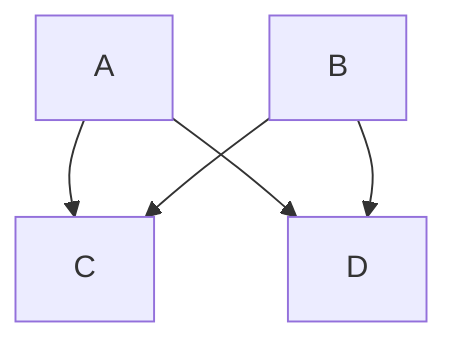

# Nouns DAO Docs Style Guide

**Purpose** — Ensure every contributor writes and structures content in a
clear, consistent, and distinctly **nounish** voice across the Docs site,
knowledge base, and tutorials.

## Scope & audience

- **Scope:** All user‑facing documentation: Concepts, How‑tos, Tutorials, Reference, Governance Proposals, Release Notes, FAQs, and Blog posts.
- **Audience:** Builders, contributors, and noun‑holders with varying Ethereum familiarity (beginner → advanced).
- **Reading mode:** Skim‑friendly first; depth second.

## Writing style

- **Language:** US English.
- **Second person:** Prefer “you”.
- **Spell out acronyms on first use**: “Decentralised Autonomous Organization (DAO)”.
- **Add new terms to [the glossary](/resources/glossary)**.

## General guidelines

- Use **relative links** between doc pages: `/protocol/auction-house`.
- Keep titles ≤ 60 chars for SEO.
- Use sentence case: only the first word and proper nouns are capitalized.
- Front-load keywords users type into search.
- Avoid gerunds and “How to…”. Prefer action verbs (e.g. “Fix auction bid errors”)
- Include diagrams for complex concepts.
- Briefly describe the purpose of the section after each heading to optimize search results.

## Front-matter

Each article **MUST** include **front‑matter**, a YAML block at the top of the file that provides metadata about the page.:

```yaml
---
title: "Nouns DAO Docs Style Guide"
description: "Nouns DAO Docs Style Guide and Contributing Guidelines"
sidebarTitle: "Contributing"
---
```

- `title`: The title of the page, used in the browser tab and as the sidebar title (unless overridden by **sidebarTitle**).
- `description`: A brief description of the content of the page. Used for SEO, AI readability and social media previews.
- `sidebarTitle` (optional): The title used in the sidebar. If not provided, the `title` will be used.


## Alerts

You can use alerts to emphasize critical information. Use them sparringly to prevent overloading the reader.

Five types of alerts are available:

### Note

```mdx
> [!NOTE]
> Useful information that users should know, even when skimming content.
```

> [!NOTE]
> Useful information that users should know, even when skimming content.

### Tip

```mdx
> [!TIP]
> Helpful advice for doing things better or more easily.
```

> [!TIP]
> Helpful advice for doing things better or more easily.

### Important

```mdx
> [!IMPORTANT]
> Key information users need to know to achieve their goal.
```

> [!IMPORTANT]
> Key information users need to know to achieve their goal.

### Warning

```mdx
> [!WARNING]
> Urgent info that needs immediate user attention to avoid problems.
```

> [!WARNING]
> Urgent info that needs immediate user attention to avoid problems.

### Caution

```mdx
> [!CAUTION]
> Advises about risks or negative outcomes of certain actions.
```

> [!CAUTION]
> Advises about risks or negative outcomes of certain actions.

## Diagrams

use [Mermaid](https://www.mermaidchart.com/play) to create charts/diagrams.

e.g. to create a flowchart, use the following syntax:

````

````

which renders as:

